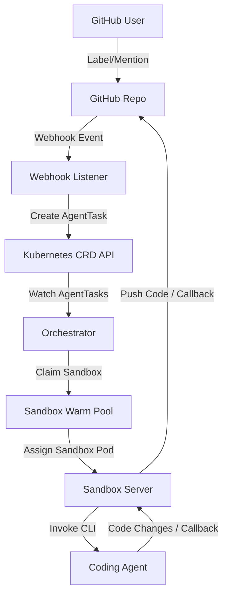

# Cloud Agent

Cloud Agent enables delegating GitHub issues and Pull Requests (PRs) to autonomous coding agents running in secure, containerized Kubernetes sandboxes. It shifts long-running AI coding tasks to the cloud, allowing developers to trigger agent execution directly from GitHub without needing to keep their local laptops active or monitor the progress in real-time.

---

## About This Project

In many enterprise environments, security policies restrict laptops from running when employees are away from their desks (AFK). This makes executing time-consuming coding agent tasks on local machines highly impractical. 

**Cloud Agent** solves this problem by using GitHub as an orchestration platform. It integrates a lightweight **Webhook Listener** that captures GitHub events, a Kubernetes **Orchestrator** to provision secure sandbox environments, and a **Sandbox Server** running inside those containers to execute pluggable coding agents (such as `pi` or `opencode`).

### Core Architecture



- **Webhook Listener**: The entry point for incoming GitHub webhooks. It parses tasks, mints scoped, short-lived tokens, and creates `AgentTask` Custom Resources.
- **Orchestrator**: A Kubernetes controller that monitors `AgentTasks`, claims sandbox environments from a warm pool using `SandboxClaims`, and manages lifecycle states.
- **Sandbox Server**: An HTTP daemon baked into the sandbox container images that receives the execution payload, triggers the CLI coding agent, and callbacks results.

---

## Capabilities

* **GitHub App Mention (Q&A / Recommendations)**: Mentions of the GitHub App in issue or PR comments trigger the agent to analyze the conversation thread, issue description, and title to provide detailed answers or recommendations posted back as a comment.
* **GitHub App Labeling (PR Generation)**: Adding a trigger label to an issue prompts the agent to clone the codebase, solve the problem, and propose a Pull Request containing the proposed fix.
* **Warm Pool Optimization**: Speeds up agent startup times by maintaining language-specific warm pools of sandboxes via the `SandboxClaims` controller.
* **Secure Review & Attribution**: Commits generated by the agent are securely attributed to the triggering user (**Task Owner**) with the GitHub App as a co-author. This forces standard enterprise repository rules, preventing the user from self-approving the generated PR.
* **Extensible Agent Integration**: Built to execute CLI-based coding agents like `opencode` and `pi`.

---

## Setup

### Prerequisites

Ensure you have the following installed locally:
- **Go** (1.21 or later)
- **Docker**
- **Kind** (Kubernetes in Docker) or another local Kubernetes cluster
- **kubectl**
- [agent-sandbox](https://github.com/kubernetes-sigs/agent-sandbox) cloned locally at `../../kubernetes-sigs/agent-sandbox` (relative to this repository)

### Local Development and Building

A `Makefile` is provided to orchestrate building, linting, and testing:

```bash
# Clean previous builds and compile all Go binaries (webhook-listener, orchestrator, sandbox-server)
make build

# Run formatting checks and code tidy
make fmt
make deps

# Run tests
make test

# Run the linter
make lint
```

### Building Container Images

To build and load the system's container images directly into a local Kind cluster (named `desktop`):

```bash
# Build and load all Pi agent images
make containers-pi

# Build and load all OpenCode agent images
make containers-opencode
```

### GitHub Application

Create github application with following

Permissions:
- Repository permissions:
   - Content (Read and write)
   - Issues (Read and write)
   - Metadata (Read-only)
   - Pull requests (Read and write)
   - Workflows (Read and write) (Only needed if you intend to update github workflow files using agent)
- Account permissions:
   - Email addresses (Read-only)

Subscribe to events:
- Issue comments
- Issues

### Kubernetes Cluster Deployment

Prepare `cloud-agent-secret.yaml` as following:
```yaml
apiVersion: v1
kind: Secret
metadata:
  name: cloud-agent-secret
type: Opaque
stringData:
  github-app-id: "<GitHub Application id>"
  github-app-webhook-secret: "<Webhook secret you set on GitHub Application>"
  github-app-key: |
    <GitHub Application private key>
  GEMINI_API_KEY: "<Gemini api key>"
  tokens-auth-secret: "<random logn password>"
```

You can deploy the resources to a local Kind cluster using the provided installation script and Kustomization manifests:

```bash
./scripts/kind-install.sh
```
